> 1'den başlayarak `n` sayısına kadar (n dahil) tüm sayıların toplamını hesaplayan bir fonksiyon yazmak istediğimizi varsayalım.

```javascript
function addUpTo(n) {
  let total = 0;
  for (let i = 1; i <= n; i++) {
    total += i;
  }
  return total;
}
```
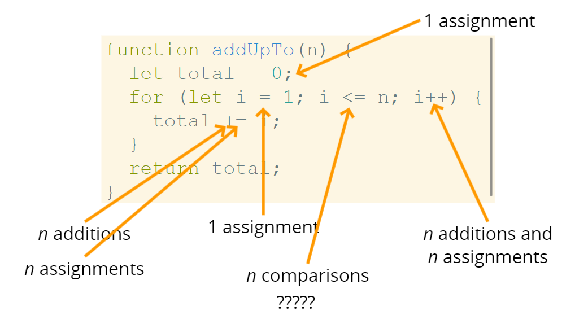

```javascript
function addUpTo(n) {
  return n * (n + 1) / 2;
}
```
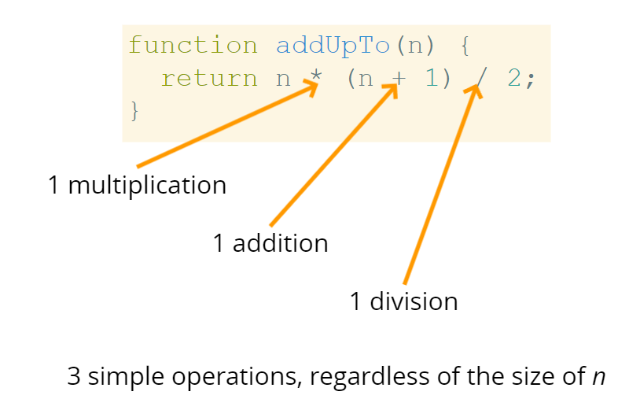

# Big O Notation
> Büyük O Notasyonu, bulanık saymayı biçimselleştirmenin bir yoludur.

> Algoritmaların çalışma süresinin girdiler büyüdükçe nasıl büyüdüğünü resmi olarak konuşmamıza izin verir.

> Sadece eğilimlerle ilgileniyoruz, detaylarla değil.

Bir algoritmanın karmaşıklığı **O(f(n))** olarak ifade edilirse, bilgisayarın gerçekleştirmesi gereken basit işlem sayısı **n** arttıkça, sabit bir katsayı ile çarpılan **f(n)** değerinden nihayetinde daha az olur.

f(n) fonksiyonu farklı şekillerde olabilir:
- Doğrusal: f(n) = n
- Karesel: f(n) = n²
- Sabit: f(n) = 1
- Diğer formlar: f(n) tamamen farklı bir form da olabilir!
  
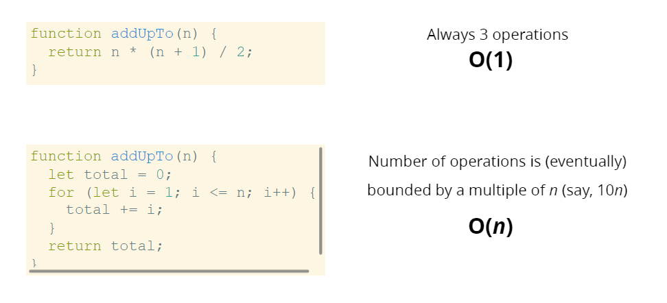
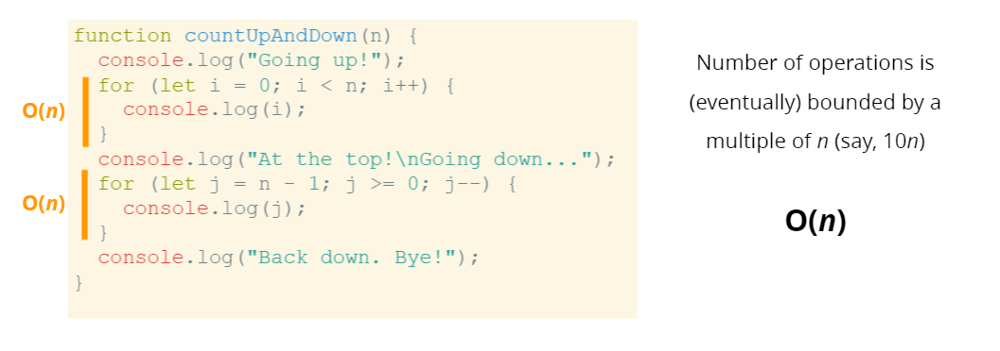
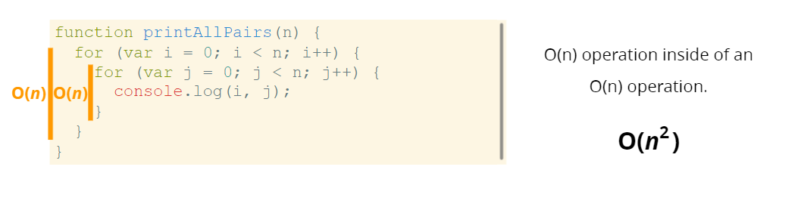


> Algoritmaların zaman karmaşıklıklarını belirlerken, Big O gösterimleri için bazı faydalı kural noktaları vardır.

> Bu kural noktaları, Big O gösteriminin tanımlanmasından kaynaklanan sonuçlardır.

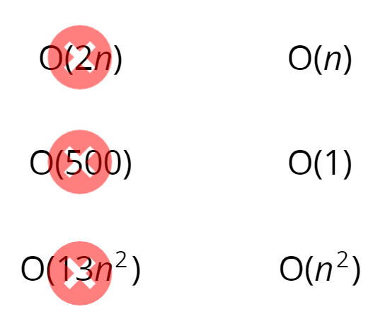
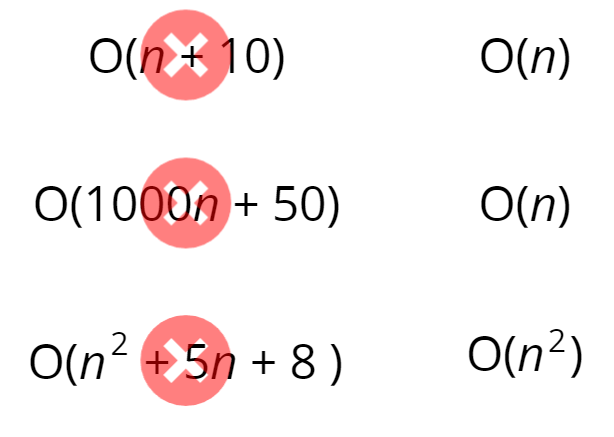

Big O ile karmaşıklığı analiz etmek zorlaşabilir.

Bu durumlarda yardımcı olabilecek bazı kural noktaları vardır. Bu kurallar **HER ZAMAN** işe yaramayabilir, ancak yararlı bir başlangıç noktasıdır.

1. Aritmetik işlemler sabittir. (toplama, çıkarma, çarpma, bölme)
2. Değişken ataması sabittir.
3. Bir dizideki elemanlara (indekse göre) veya bir nesnede (anahtara göre) erişim sabittir.
4. Bir döngüde, karmaşıklık, döngünün uzunluğu ile döngü içindeki işlemin karmaşıklığının çarpımıdır.

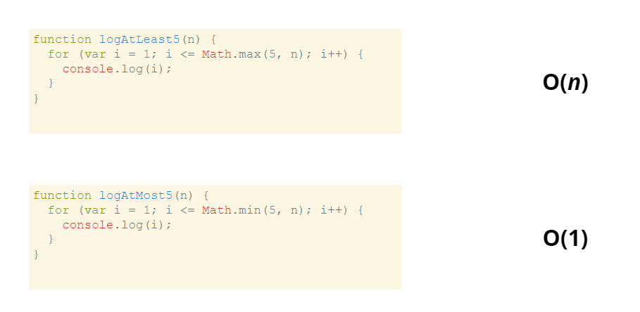
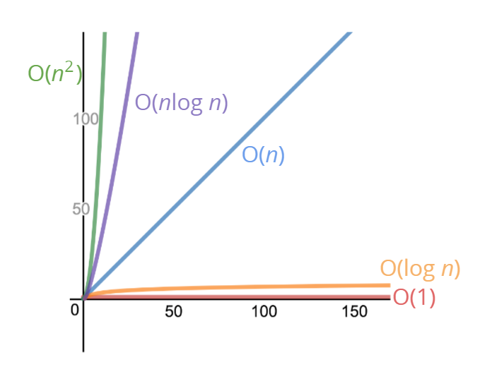

## Uzay Karmaşıklığı

Şimdiye kadar, **zaman karmaşıklığına** odaklanıyorduk: Girişlerin boyutu arttıkça bir algoritmanın çalışma süresini nasıl analiz edebiliriz?

Büyük O notasyonunu kullanarak ayrıca **uzay karmaşıklığı**'nı da analiz edebiliriz: Algoritmamızdaki kodu çalıştırmak için ne kadar fazla ek bellek ayırmamız gerekiyor?

## Inputs ne durumda?

Bazen, girdilerin kullandığı alan hariç, algoritma tarafından ihtiyaç duyulan alanı belirtmek için **yardımcı uzay karmaşıklığı** terimini duyacaksınız.

Aksi belirtilmedikçe, uzay karmaşıklığı hakkında konuştuğumuzda, teknik olarak yardımcı uzay karmaşıklığından bahsediyor olacağız.

> Uzay Karmaşıklığı JS'de (_Kısa Kurallar_)<br>
> - Çoğu ilkel tip (booleans, numbers, undefined, null) sabit uzay kullanır.
> - Strings O(n) uzay gerektirir (n dizenin uzunluğudur).
> - Referans türleri genellikle O(n)'dir; burada n dizi (array) uzunluğu veya anahtar sayısıdır (nesneler için).

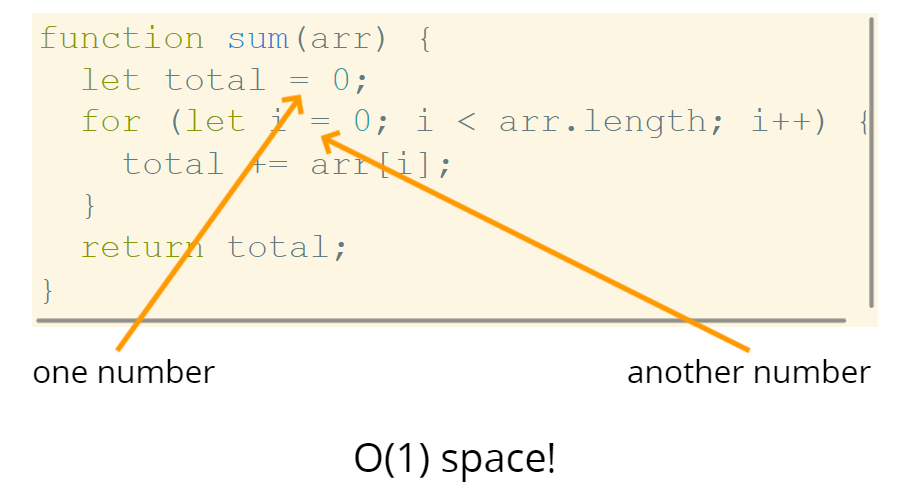
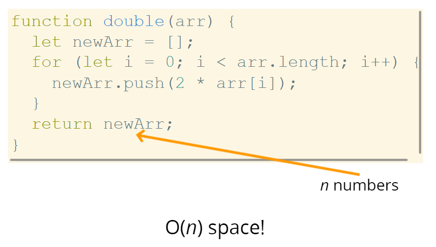


## Logarithms

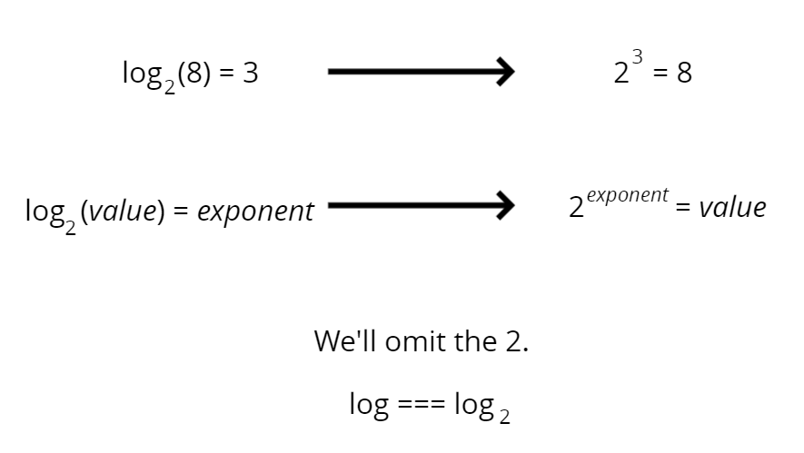

> Belirli arama algoritmaları, logaritmik zaman karmaşıklığına sahiptir. <br>
> Verimli sıralama algoritmaları logaritmaları içerir.<br>
> Rekürsiyon bazen logaritmik uzay karmaşıklığına sahiptir.

## Algoritma Performans Analizi
- Bir algoritmanın performansını analiz etmek için Big O Notasyonunu kullanırız.
- Big O Notasyonu, bize bir algoritmanın zaman veya uzay karmaşıklığı hakkında üst düzey bir anlayış sağlayabilir.
- Big O Notasyonu hassasiyete değil, yalnızca genel eğilimlere (doğrusal mı, karesel mi, sabit mi?) önem verir.
- Zaman ve uzay karmaşıklığı (Big O ile ölçüldüğü gibi) yalnızca algoritmaya bağlıdır, algoritmayı çalıştırmak için kullanılan donanıma bağlı değildir.

## Grafik
