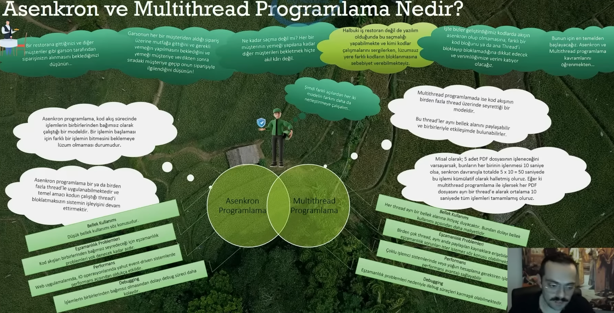
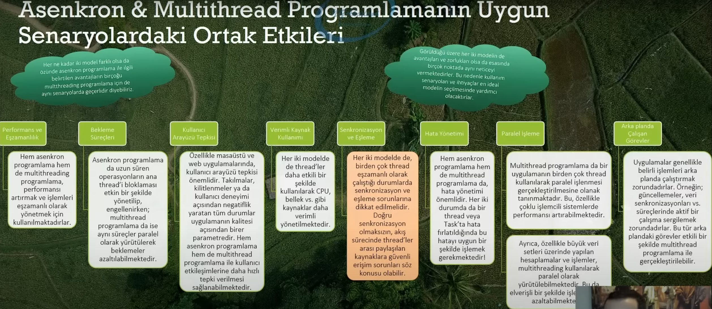
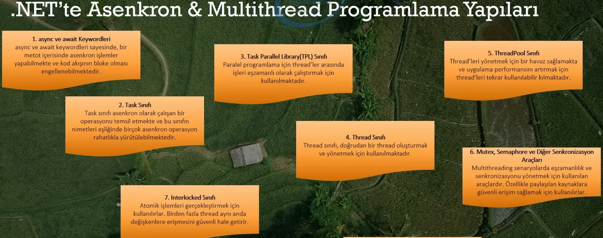

thread -> iş parçacığı

- Asenkron Programlamada da **Eş zamanlılık** sorunu olabilir hala

! Asenkron programlama ile Multithread programlama aynı şey değildir.

Asenkron programlama da amaç ana thread'i bloklamadan çalışma yürütmek iken, multithread programlama da ise yapılacak operasyonların birden fazla thread üzerinde eş zamanlı olarak işlenmesidir.

- Bu da elverişli bir şekilde işlem hacmini ve maliyetini azaltabilmektedir

## Hangisini, Hangi Senaryolarda Kullanmalı?

## .NET'te Asenkron & Multithread Yapıları

Ve daha fazlası...

## Task ile Thread Sınıflarının Farkları Nelerdir?

## -

