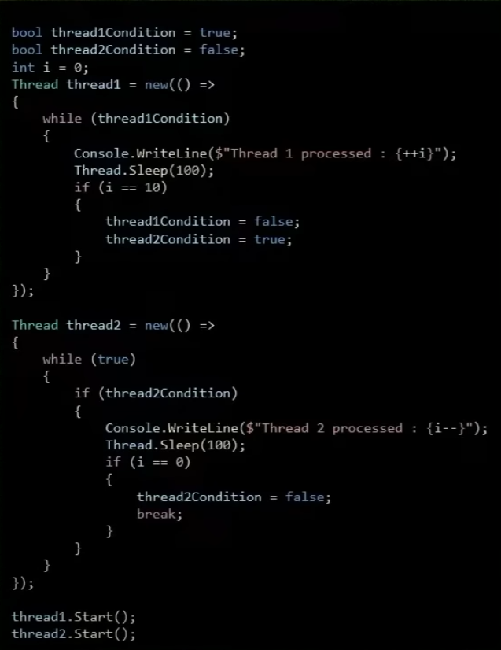
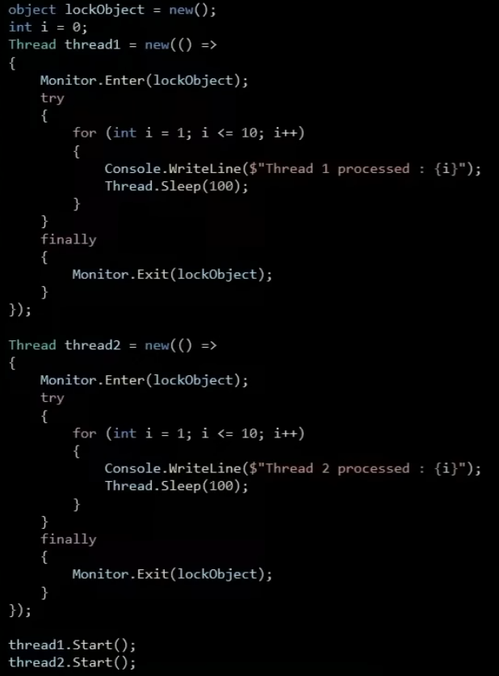
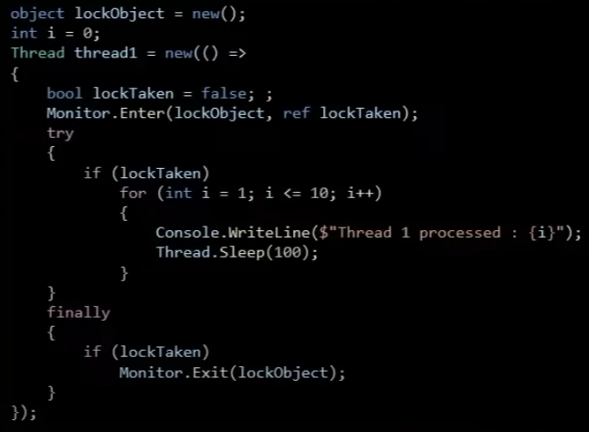
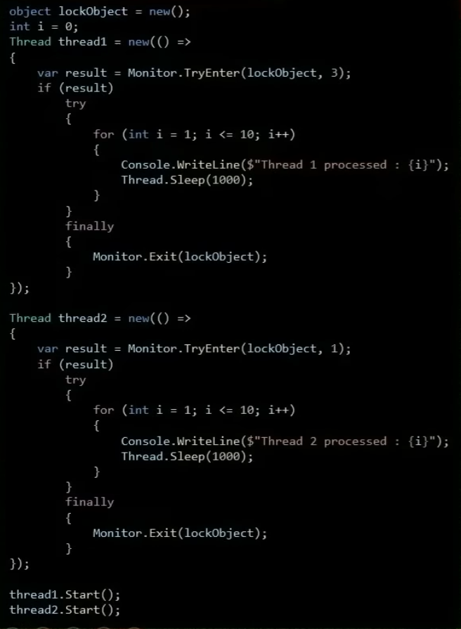
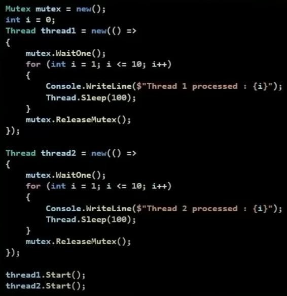
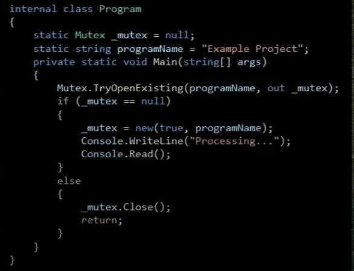
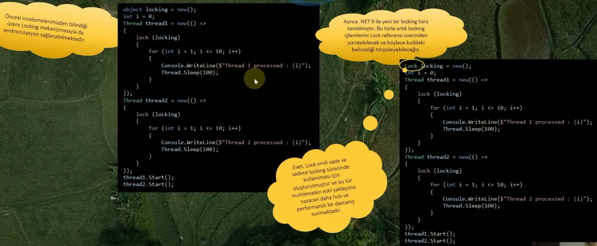

- C#'da thread senkronizasyonu, birden fazla thread'in aynı anda aynı kaynaklara erişmesini düzenlemek ve kontrol etmek için kullanılan bir tekniktir.

- Thread'ler birbirlerinden ve main thread'den bağımsız olarak aynı anda çalışabilen kod bloklarıdır. Eğer birden çok thread, aynı anda paylaşılan/ortak bir kaynağa erişirse, bu durumda **race condition** denen çeşitli sorunlar ortaya çıkabilmektedir.

- Bunun dışında kilitlenme (**deadlock**) veri bozulması ve performans kaybı gibi durumlarda söz konusu olabilmektedir.

- İşte thread senkronizasyonu, bu tür sorunları önlemek veya minimize etmek amacıyla kullanılan davranışları kapsayan bir yaklaşımlar bütünüdür

- senkronizasyon ne CLR ne de işletim sistemi tarafından otomatik olarak gerçekleştirilen bir yapılanma değildir, yazılımcıların sorumluluğundadır.

### Thread Senkronizasyonu Neden Önemlidir?

- Thread senkronizasyonu; multi-thread uygulamalarda, operasyonel güvenliği ve işlem doğruluğunu arttırmak için önemlidir. Ancak, aşırı kullanımı performans sorunlarına yol açabilir, bu nedenle senkronizasyon araçlarının dikkatli bir şekilde seçilmesi ve kullanılması gereklidir.

### Senkronizasyon Yaklaşımları

#### Blocking Synchronization

Bu yaklaşımda, bir thread diğer bir thread'in tamamlanmasını veya veriye erişimini beklemektedir. Bu bekleme, belirli bir koşula bağlı olabileceği gibi locking mekanizmalarıyla da sağlanabilir. Bloke edilen thread, diğer thread'in işi tamamlandıktan sonra devam eder.

#### Non-Blocking Synchronization

Bu yaklaşımda ise thread'lerin birbirlerini bloke etmeksizin eşzamanlı olarak çalışması söz konusudur.

### Blocking Synchronization

- Blocking senkronizasyon, ortak kaynakları paylaşan thread süreçlerinde, bir thread'in diğer thread'i beklemesi esasına dayanmaktadır.

- Bu yaklaşımda, bir thread'in bir kaynağa erişim sağlaması gerektiğinde, diğer thread'lerin o kaynağa erişimini beklemeleri anlamına gelmektedir.

- Bu bekleme, bir thread'in kritik bölgesine (**critical section**) girmesi için diğer thread'lerin durmaları veya beklemeleri gerektiği anlamına gelmektedir.

- Blocking senkronizasyon sayesinde, aynı anda sadece bir thread'in kritik bölgeye erişimine izin verilmesi garanti altına alınmakta ve böylece veri bütünlüğü korunmaktadır.

- Burada unutulmaması gereken nokta, blocking senkronizasyon süreçlerinde performans sorunları olabilir. Ki özellikle yoğun şekilde kullanıldığı veya bir thread'in kritik bölgeyi uzun süre işgal ettiği durumlarda dikkat edilmelidir.

- Bu durumlara karşın senkronizasyon stratejileri dikkatlice tasarlanmalı ve uygulanmalıdır!

### Spinning Nedir?

- Senkronizasyon mekanizmalarında blocking'e benzer bir yaklaşım olan spinning, thread'leri belirli koşula karşın döngü ile bekletmeyi yani bloklatmayı sağlayan bir davranışı ifade etmektedir.

- Bu yaklaşım, beklenen koşul gerçekleşene kadar thread'in aktif bir şekilde çalışmasını ve diğer thread'lere geçiş yapmamasını sağlar. Bu tür bir bekleyiş **busy-waiting** veya **spinning** olarak adlandırılır.

**!** Spinning, thread'in diğer thread'lere geçiş yapmadan sürekli olarak işlemciyi kullanmasına neden olabilir.

Bu durum, işlemci kaynaklarını etkili bir şekilde kullanmayabilir ve bu nedenle, uzun süreli beklemelerde veya yüksek talep durumlarında spinning davranışı önerilmemektedir.

Çok nadir de olsa belirli senkronizasyon durumları için spinning uygun olabilir ancak genellikle daha verimli ve etkili senkronizasyon stratejileri tercih edilmelidir

## Monitor.Enter | Monitor.Exit Metotları

- Bunlar **locking** mekanizmasının fonksiyonel versiyonlarıdır.

- Monitor.Enter, lock mekanizmasında olduğu gibi belirli nesne üzerinden kilit almaya çalışmaktadır. Eğer başka bir thread bu kilidi almışsa beklemeye alınacaktır. Kilit süresince de diğer thread'ler bu kritik bölgeye erişemeyecektir.

- Monitor.Exit ise Monitor.Enter ile kilitlenmiş nesneyi serbest bırakır

**!** İlgili kod hata fırlattığı zaman try-catch-finally olmadığında Exit metodu çağırılmayacağı için thread deadlock'a düşer, try-cath kullanmak daha güvenli yani

- Locking mekanizması da arka planda buna benzer Enter/Exit gibi metotlarını kullanmaktadır.

- Çok nadirde olsa Monitor.Enter metodunun kilitleyememe durumu olabiliyor. Bu yüzden bu durumu anlayabilmek için **lockTaken** parametresini kullanabiliriz.

- Yani lockTaken sayesinde, Monitor.Enter ile bir kilidin başarıyla alınıp alınmadığını kontrol etmektedir. Bu durumu kontrol etmek, thread'in kritik bölgeye güvenli bir şekilde erişip erişemediğini belirlemek için önem arz etmektedir.

- Bu özelliği genellikle birden fazla thread ile çalışırken, bir thread'in kidi aldığını ve diğerlerinin kilidi alamadığını kontrol etmek için kullanmayı tercih ediyoruz.

- Bu sayede diğer iş parçacıkları kilidi beklemek yerine başka işlemler yapabilmekte ve kaynak kullanımı daha verimli hale getirilebilmektedir.

## Monitor.TryEnter Metodu

- Bir nesne üzerinde lock almayı deneyen ve alınıp alınmadığını kontrol eden bir C# senkronizasyon yöntemidir.

- Bu metot ile bir kodu kilitlemeye çalışırken rekabet eden diğer thread'lerle ilişkili riskler kontrol edilmektedir.

- Bir kodun akışı verilen milisaniye cinsinden sürede kilitlenmeye çalışılmakta ve eğer başarılı olursa kilitlenmekte ve geriye de **true** değeri döndürülmektedir. Aksi taktirde **false** döndürülecektir.

- TryEnter'in bu özelliği sayesinde kilit alınamadığı taktirde beklemek yerine hemen farklı işlemlere devam etme imkanı elde etmekteyiz.

- Kritik bölgeye ulaşmada geçici bir başarısızlığa izin vermek ve ardından tekrar denemek istenilen durumlarda oldukça kullanışlıdır.

- Ancak bu konuda dikkat etmekte fayda vardır, sürekli tekrar denemek yerine bir süre beklemenin daha uygun olduğu durumlar daha fazladır.

## Mutex

- **Mutex**, locking mekanizmasına benzer şekilde bilgisayar seviyesinde process'ler arası kilitleme işlemi yürütebilen özel bir yapılanmadır.

- Anlam olarak mutual exclusion kelimelerinin kısaltması olan **Mutex**, kritik bölgelere erişimi kontrol etmek için kullanılan bir senkronizasyon mekanizmasıdır.

- Bu sınıf sayesinde bizler ortak kaynaklara yahut kritik bölgeye eş zamanlı olarak erişimi kontrol edebilmekte ve snekronizasyonu sağlayabilmekteyiz.

### Mutex ile Single Instance Application

- Mutex ile process seviyesinde kilitleme yapabildiğimiz için bilgisayarda ilgili uygulamadan sadece 1 tane çalışmasını sağlayabilmekteyiz.

- Single Instance Application ile derlenmiş bir uygulamanın sadece tek bir instance'ının çalıştırılmasını sağlayabiliriz

## Locking Mekanizması ve .NET 9'da Yeni Locking Referansı

