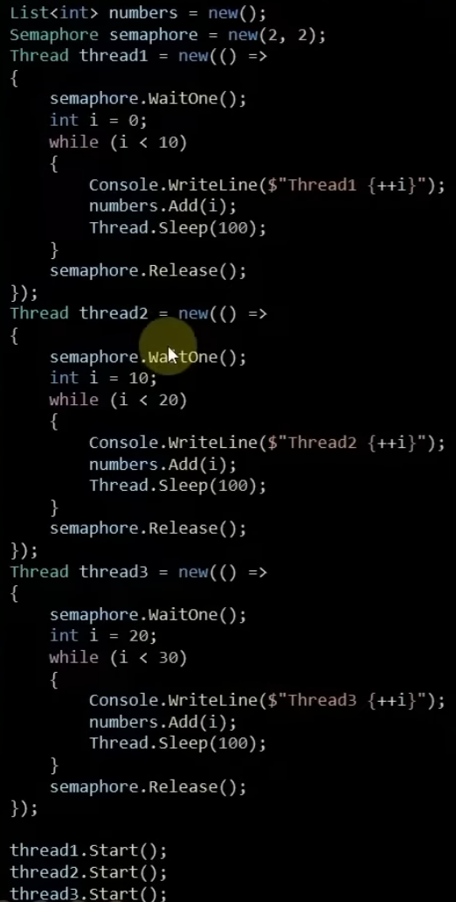
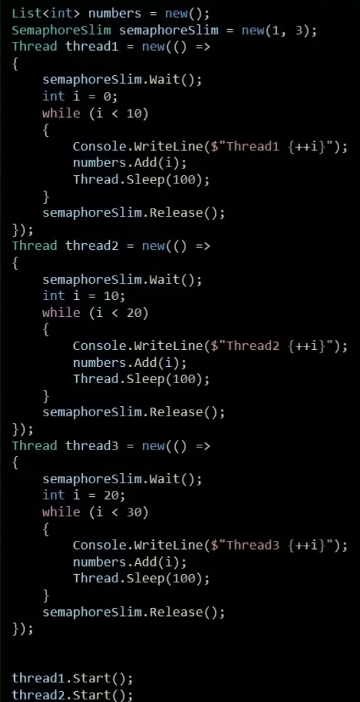

Kritik bölgeye erişmesi gereken thread saysını yönetmemizi sağlamaktadırlar

# Semaphore & SemaphoreSlim Nedir?

- C# dilinde, multi-threading yaklaşımında kullanılan **Semaphore & SemaphoreSlim** sınıfları birer senkronizasyon araçlarıdır.

- Bu araçlar sayesinde kaynaklara olan erişim kontrol edilmekte ve eşzamanlılık sorunlarına karşı önlemler alınabilmektedir.

- Davranışsal olarak bu sınıflar sayesinde, belirli bir kaynağa aynı anda belirtilen sayıda thread tarafından erişime izin verilmekte ve bununla ilgili yönetim sergilenebilmektedir.

- Yani bu sınıflar sayesinde, bir kaynağın eşzamanlı olarak farklı thread'ler tarafından kullanılabilmesi için izin verme/kapatma mantığı kurgulanabilmektedir.

- Thread'ler kaynağa erişim sağlamadan önce bu sınıfların davranışı gereği sembolik olarak izin almaktadırlar. Bu izin veriliyorsa eğer ilgili kaynağa erişim sağlamaktadırlar, yok eğer izin alınamıyorsa bekletilmektedirler.

- Bu sınıfların ortak amacı bahsedildiği gibi olsa da ikisi arasında performans ve özellikleri arasında farklar mevcuttur.

| Semaphore                                                                                                                                                         | SemaphoreSlim                                                                                                               |
| :---------------------------------------------------------------------------------------------------------------------------------------------------------------- | :-------------------------------------------------------------------------------------------------------------------------- |
| - SemaphoreSlim'e göre daha eski bir senkronizasyon yöntemidir.                                                                                                   | - Semaphore'dan daha yeni ve daha hafif bir yapıya sahip olan bir senkronizasyon yöntemidir.                                |
| - .NET 2.0'da tanıtılmıştır                                                                                                                                       | - .NET 4.0'da tanıtılmıştır                                                                                                 |
| - Bir kaynağa(paylaşılan bir veri yapısına veya kritik bir bölgeye) belirli sayıdaki thread'ler tarafından eşzamanlı erişimi kontrol etmek için kullanılmaktadır. | - Semaphore'a nazaran daha hızlı çalışmakta ve buna rağmen de düşük bellek tüketimi ile düşük maliyet durumu söz konusudır. |
| - İşletim sistemleri kaynaklarına bağlıdır. Bu nedenle işletim sistemi tarafından işletilen bir sınıftır.                                                         | - İşletim sistemine bağlı değildir. Dolayısıyla daha hızlı ve atiktir.                                                      |
| - Senkron davranış sergilemektedir.                                                                                                                               | - Hem senkron hem de asenkron bir davranış sergileyebilmektedir.                                                            |

#### Semaphore ve SemaphoreSlim, multi-threading yaklaşımında kaynak paylaşımını güvenli bir şekilde yönetmek için kullanılan önemli araçlardır. Hangi senkronizasyon aracının kullanılacağı, projenin ihtiyaçlarına, performans gereksinimlerine ve kullanım senaryolarına bağlı olarak değişmektedir.

### Semaphore

- Semaphore, daha ağır ve hantal bir çalışmak sergilemektedir. Bundan dolayı büyük işlemler/operasyonlar için daha uygundur.

- Semaphore'da bir kez release edilen tekrardan alınamaz.

- Semaphore sınıfı davranışsal olarak arkaplanda bir sayaç ve kuyruk içerir. Thread, bir kaynağa erişmek isterken, Semaphore sayacı bir azaltır ve eğer sayaç **0** değilse kaynağa erişim izni verir.

- Sayaç **0** ise, thread kuyruğa alınır ve sayaç artana kadar bekletilir.

- Bir thread kaynaktan ayrıldığında (yani release edildiğinde) sayaç bir artar ve kuyruktaki diğer thread'lerden biri kaynağa erişir.

- Sayacın değeri, Semaphore'un contructor'ında ki ilk parametre olan **initialCount** ile belirlenmektedir.

- MaksimumCount değeri initialCount değerinden küçük olamaz.



### SemaphoreSlim

- SemaphoreSlim, daha hızlı çalışan ve düşük bellek tüketimi olan bir araçtır. Semaphore'dan daha yeni bir senkronizasyon aracı olsa da, daha sınıflı bir çalışma sergileyebilmektedir.

- SemaphoreSlim sınıfı da davranışsal olarak arkaplanda bir sayaç ve kuyruk içermektedir.

- Aynı Semaphore'da olduğu gibi sayaç **0** olduğu sürece kritik bölgeye thread'leri eriştirmeyecek, bekletecektir.

- Ayrıca Semaphore'dan bir farkı da asenkron davranış sergileyebilmesidir. Yani Wait ile izin isterken, buradaki süreeci WaitAsync ile de asenkron bir şekilde işlemimizi yapabilmektedir, ve bulunan thread'i bloklamadan işlemi yapabilmektedir.

- Bu yüzden yüksek talep ve optimizasyon gerektiren çalışmaların yanında asenkron operasyonlarda da Semaphore yerine SemaphoreSlim tercih edilmelidir.



### Semaphore & SemaphoreSlim İdeal Bekleme Sürelerini Ayarlama

- Her iki araçla da izin isteme sürecinde ideal/adil süreyi belirleyebilir ve çalışmalarımızda bu derece kritik dokunuşlarda bulunabiliriz.

```csharp
semaphore.WaitOne(1000);
semaphoreSlim.Wait(1000)
```

- Her ikisi de **1** saniye boyunca izin verilmesini bekleyecek, aksi taktirde akış devam edecek ve kritik bölgeye erişim gerçekleşecektir.

**!** Kullanılan araç Semaphore & SemaphoreSlim olsun, işimiz bitince **Dispose** etmeliyiz. (Bellek yönetimi, GC vs.)
**!** Optimize olması gereken yerlerde **SemaphoreSlim** tercih edilmesi tavsiye edilmektedir.

```csharp
using Semaphore semaphore = new(2, 2);
using SemaphoreSlim semaphoreSlim = new(2, 2);
```
