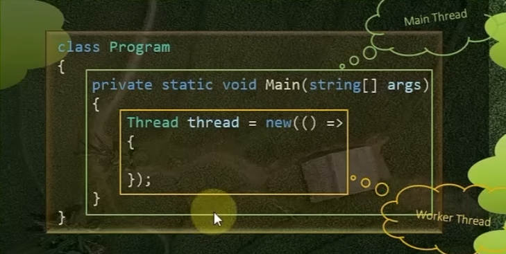
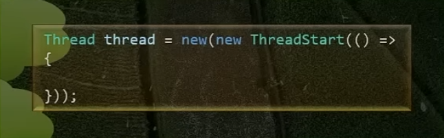
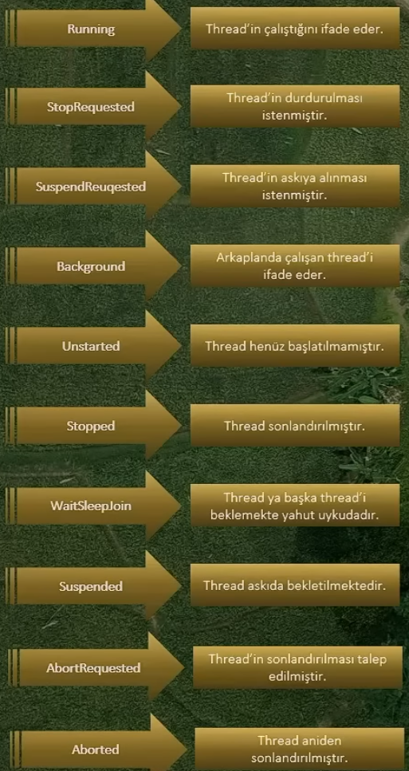

C# dilinde, multithread programlama, bir programın aynı anda birden fazla thread tarafından yürütülmesini sağlayan yaklaşımdır

Thread ise bir işlem içinde bağımsız olarak çalışabilen en küçük yürütme birimidir.

Bir program çalışırken öncelikle **main thread** olarak adlandırılan bir thread bulunur. Main thread'den sonra ek olarak yardımcı thread'ler oluşturulabilir ve bunlara da **worker thread** denmektedir.

İşte bizler bu worker thread'ler arasında paralel ve eş zamanlı çalışmalar sağlayabilir ve multithread yaklaşımını sergileyebiliriz.

C#'da multithread yaklaşımını sergileyebilmemiz için **System.Threading** namespace'i altında **Thread** sınıfı sunulmuştur.

Bizler bu sınıf ile main thread'in dışında, yeni thread'ler oluşturabilir ve kontrol edebiliriz.




- İki görselde aynıdır, ilk görseldeki gibi oluşturduğumuzda da arka planda yeni bir **ThreadStart** delegate oluşturmaktadır

Thread oluşturulduktan sonra Start metodunu çağırarak thread'i başlatabiliriz

```csharp
Thread thread = new(() => {
    //....
});

thread.Start();
```

#### Parametli bir thread oluşturunca parametreyi ...Start() metodu içerisinde parametre olarak vermeliyiz

C#'da oluşturulan her bir thread arka planda bir kimlik ile ilişkilendirilir. Bu kimliği kullanarak trace ve debug işlemlerini daha rahat takip edebiliyoruz.

thread'ler arası hedefsel haberleşmeyi sağlayabilmekte ve kaynak yönetimi gibi türlü işlemlerri gerçekleştirebilmekteyiz.

Thread'lerin id değerine erişebilmek için


- AppDomain.GetCurrentThreadId() -> deprecated edilmiştir (kararlı id değeri sağlayamıyor)

IsBackground

Bu property bir thread'in arka planda çalışıp çalışmayacağını belirlemektedir, ve arkaplanda çalışacak olan bir thread main thread'e bağlı bir şekilde davranışını sürdürecektir.

Yani main thread sona erdiği zaman arka plandaki thread de otomatik olarak sonlandırılacaktır. Bu demektir ki arkaplanda çalışmayan bir thread(foreground thread) ise main thread sona erse bile devam edecektir.

```csharp
Thread thread = new(() => {
    //....
});

thread.IsBackground = false;
thread.Start();
```

### Main thread, worker thread bitene kadar bekler, eğer ki bu thread tamamlanmazsa uygulama sonlanmaz.

True değerini verdiğimiz zaman da worker thread beklenmez ve thread işleminin tamamlanması beklenmez.

Bu özellik arka planda çalışacak servisler veya uzun süren görevler gibi durumlarda uygulamanın davranışını kontrol etmek için kullanışlıdır.

## Thread State

Oluşturulan thread'ler, mevcut durumlarını ifade etmek için State bilgisi barındırmaktadır.

Bu bilgi **ThreadState** türündedir ve bir thread'in şu anda hangi durumda olduğunu belirten bir state verisidir.



## Race Conditions Nedir? ve Nasıl Önlemler Alınır?

Race Conditions, multithread programlama süreçlerinde iki veya daha fazla thread'in aynı kaynağa(veri, değişken, bellek alanı vb.) eş zamanlı olarak erişmesi durumunda ortaya çıkan istenmeyen durumlardır.

Örneğin; birden çok thread aynı anda bir değişken üzerinde okuma veya yazma işlemleri gerçekleştiriyorsa, bu durumda race condition oluşabilir ve bir thread değeri okurken diğer thread ise aynı değeri değiştirebilir ve bu durum beklenmeyen sonuçlara yol açabilir.

Ya da bir thread henüz diğer thread'in tamamlanmamış işi üzerinde işlem yaparak da race condition durumuna sebebiyet verebilir.

#### Nasıl önleyeceğiz?

Senkronizasyon teknikleri kullanacağız. Bu teknikler sayesinde birden çok thread'i aynı anda bir kaynağa kontrollü bir şekilde eriştirebilecek ve kritik arz eden kaynaklarda yalnız bir thread'in çakışmasına izin veriyor olacağız.

##### Thread'ler Arası Locking

- Locking mekanizması, birden fazla thread'in aynı anda paylaşılan kaynağa erişimini kontrol etmemizi sağlayan en temek yapılanmadır. Amacı, verilerin eş zamanlı erişiminin güvenli ve tutarlı olmasını sağlamaktır.

- Locking mekanizması, aynı anda sadece tek bir thread'in belirli bir kod bloğuna erişmesini sağlamakta ve böylece paylaşılan kaynaklara birden fazla thread'in müdahalesini engelleyerek race conditions durumlarına engel olmaktadır ve böylece veri bütünlüğü sağlanmaktadır.

- Locking mekanizması, genellikle kodda kritik bölge (critical section) olarak adlandırdığımız bölgede kullanılmaktadır.

- Lock yapılınca diğer bekleyen threadler iptal edilmez, işletim sistmeinin sıraladığı thread'ler sırasıyla çalıştırılır.

- Lock mekanizması çok hızlı çalışan bir yapıya sahiptir ama içerisinde bulunan kodların mümkün olduğu kadarıyla az olmasına özen gösterilmelidir

## Thread Sleep

Bu metod bir thread'i belirli bir süre boyunca duraklatmak(uyutmak) için kullanılmaktadır ve bu metot sayesinde belirtilen süre kadar thread pasif duruma getirilir ve bu süre sonunda thread tekrar aktif hale gelir

- İdeal bir thread çalışmasında Thread.Sleep metodununu 0 saniye verilmişte olsa kullanılması önerilir. Özellikle işlem hızı açısından bir endişe var ise **Thread.Sleep(0)** diyerek ilgili thread ve CPU için bir rahatlama zamanı oluşturulabilir.

## Thread Join

- Bir thread'in, başka bir thread'in işleminin birmesini beklemesi için kullanılan metottur.

- Bu bekleme sürecinde main thread'de bloklanacaktır

- Yani, **Join** metodu ile thread'ler arası senkron bir davranış gerçekleştirilebilmektedir.

- Join metodu, özellikle bir thread'in tamamlanmasını bekleyip, ardından başka bir thread'in çalışmasını sağlamak istediğimiz durumlarda kullanmaktayız.

- Bu yöntem race conditions'ı önlemek ve programın doğru bir şekilde çalışmasını sağlamak için kullanılabilir.

## Thread İptal etmek

- Bir thread'in çalışmasını iptal etmek için eskiden Thread.Abort metodu kullanılıyordu ama bu metot thread'i aniden durdurması ve bundan dolayı kaynakların düzgün bir şekilde temizlenmemesi durumuna neden olmasından dolayı deprecated edilmiştir.

- Bu nedenle artık bir thread'i durdurmak için daha güvenli bir yöntem olan **işaretle ve bitir** ( graceful shutdown ) yaklaşımını kullanıyoruz

- İşaretle ve bitir yaklaşımında thread içerisinde belirli bir şart veya flag kontrol edilir ve bu şart gerçekleştiğinde thread'in çalışması sona erdirilir.

- veya CancellationToken ile de bu işlemi yapabiliyoruz

```csharp
Thread thread = new((cancellationToken) => {
    var cancelToken = (CancellationTokenSource)cancellationToken;
    while(cancelToken?.IsCancellationRequested is false) {
        Console.Write("...");
    }
    Console.WriteLine();
    Console.WriteLine("Thread tamamlandı");
});

CancellationTokenSource cancellationTokenSource = new();

thread.Start(cancellationTokenSource);
Thread.Sleep(TimeSpan.FromSeconds(5));
cancellationTokenSource.Cancel();
```

## Interrupt

- Bir thread'i bekleyen durumdan uyandırma kve çalışma durumunu kesintiye uğratmak için kullanılan metottur.

- Ancak, Interrupt metodunun kullanımında dikkat edilmelidir, çünkü uyandırılan thread hala bekleyen bir durumdaysa (Sleep veya Wait gibi) **ThreadInterruptedException** hatası fırlatılır

- Bu metot ile thread'i bekleme durumundayken tamamlanmaya zorlayabiliriz

- Veya, uykuda ola nbir thread'i uyandırmak ve işlemlerine devam ettirmek amacıyla da kullanabiliriz
