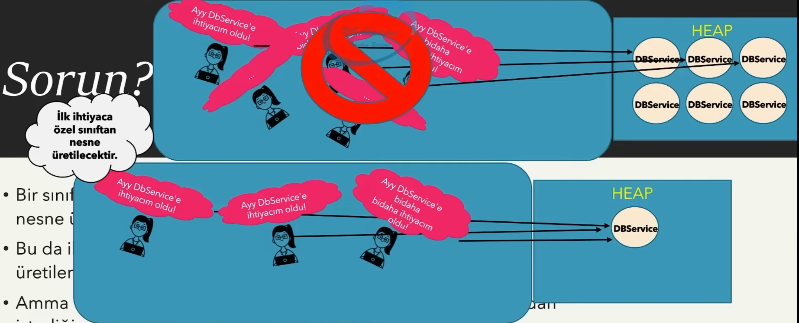
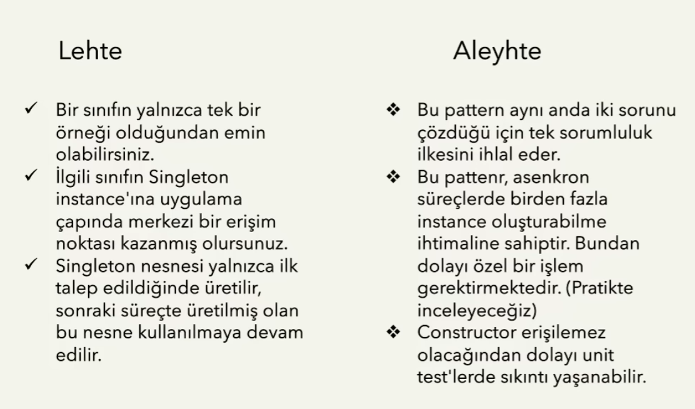

Uygulama bazında bir sınıfın sadece tek bir instance'ını kullanmamız gerektiği zaman bunu bize sağlayan yapıdır.

Bir iş konseptinde, bazı verilerin sistemde sadece tek bir instance'da saklanması gerekebilmektedir.

İşte bu verilerin tutulacağı modellerin Singleton Pattern'ına göre tasarlanması daha uygundur.

## Hangi sorunlara çözüm getirir?

- Bir sınıfı _Singleton_ yapmak demek, o sınıftan sadece tek bir nesne üretilmesi demektir.

- Bu da ilgili sınıftan **new** operatörü ile istenildiği kadar nesne üretilememesi anlamına gelmektedir.

- Ama bizler **new** operatörünü kullanarak uygun sınıflardan istediğimiz kadar nesne üretebilmekteyiz!

- İşte bu durumda _Singleton_ yapılacak sınıftan **new** operatörü ile nesne üretimini engellememiz gerekmektedir.

- Genellikle servis sınıflarında kulllanılır, entity gibi yerler mantıken singleton olmamalı

|         | 1. Yöntem                                                                                                                                                                                                                          | 2. Yöntem                                                                                                                                                                                                   |
| ------- | ---------------------------------------------------------------------------------------------------------------------------------------------------------------------------------------------------------------------------------- | ----------------------------------------------------------------------------------------------------------------------------------------------------------------------------------------------------------- |
| 1. Adım | Sınıftan **new** operatörü ile nesne üretimi engellenir. Bunun için constructor erişimi private yapılır.                                                                                                                           | Aynı                                                                                                                                                                                                        |
| 2. Adım | Üretilecek tekil instance'ı tutacak static bir referans noktası alınır.                                                                                                                                                            | Aynı                                                                                                                                                                                                        |
| 3. Adım | Instance talep etmemizi sağlayacak bir metot ya da property tanımlanır. Bu member, static olan referans'a ait bir nesne var mı kontrol eder. Varsa o nesnesi döndürür, yoksa yeni oluşturup referans'la işaretleyip yine döndürür. | Instance talep etmemizi sağlayacak bir meXtot ya da property tanımlanır. Bu member, static olan referans'ı kontrolsüz direkt geri döndürür. Nesne üretim sorumluluğunu static constructor'da gerçekleştirir |

Global olarak benzersiz/tekil nesneler sağlayabilmek için bunu _Singleton_ kullanmanın yanı sıra static yöntemlerden faydalanarak da gerçekleştirebiliriz. Tabi _Singleton_ pattern'i tercih etmemizin sebebi yazılımcının iradesiyle ilgili sınıftan bir nesne oluşturulmasını engellemektir. Bunun için global olarak benzersiz/tekil nesne üretmekse gayemiz, hedef sınıfa _Singleton_ pattern'ı uygulamak amaca daha uygundur.

## Singleton Design Pattern Ne Değildir?

- Global değişkenlere erişmek için _Singleton_ pattern'ı kullanmak bu kalıbın amacını ihlal edebilir. Eğer varsa global değerler bunları static bir üye olarak tasarlamanız daha doğru olacaktır.

- Global değişkenlerden ziyade herhangi bir fiiliyata odaklanmış bir nesnel yapının tekilliğinden bahsediyorsak eğer işte o zaman _Singleton Pattern_ düşünülmelidir.

## Avantajları/Dezavantajları

Hem sınıfı üretir hem de sınıfın işlemlerini yaptığı için **Single responsibility** prensibini ihlal eder

## Sınırlılıkları

## Diğer Pattern'larla İlişkileri

- Bazen, bazı sınıflardan tek bir nesne değil de belirli bir sayıda nesne oluşturulması da gerekebilmektedir. Bunun için ihtiyaç olacak kadar nesneyi üretebilir ve bir koleksiyon aracılığıyla gerekli kontrolleri sağlyabiliriz. Buna **Multiton Pattern** denilmektedir.

- **Facade Pattern**'ın çoğunlukla _Singleton_ olarak tasarlanması daha elverişlidir.

- **Flyweight Pattern**, _Singleton Pattern_'a benzeyebilir. Ama ikisinin arasındaki radikal fark Singleton nesneleri değiştirilebilir fakat Flyweight nesneleri değiştirilemez!
- **Abstract Factories**, **Builders** ve **Prototypes Pattern**'ların hepsi _Singleton_ olarak tasarlanabilir.

# -

Global değişkenler üzerinde **daha sıkı** denetime ihtiyacımız olduğu zaman _Singleton_ modelini kullanabiliriz
