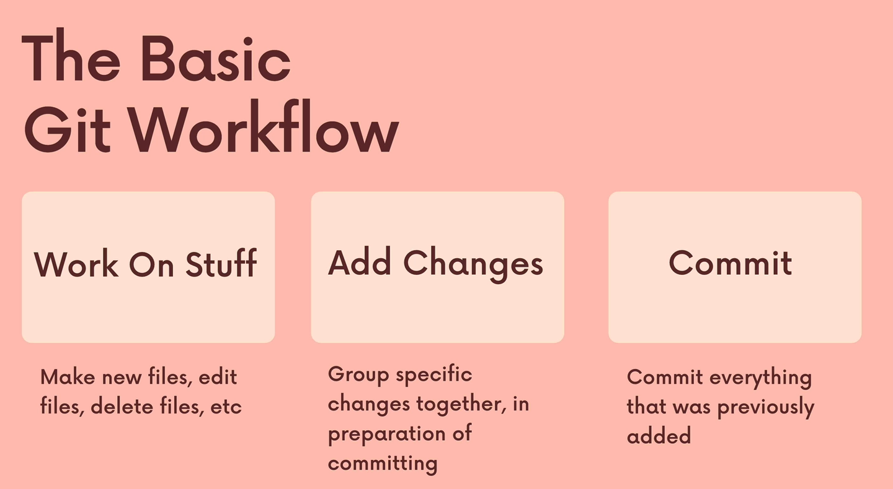
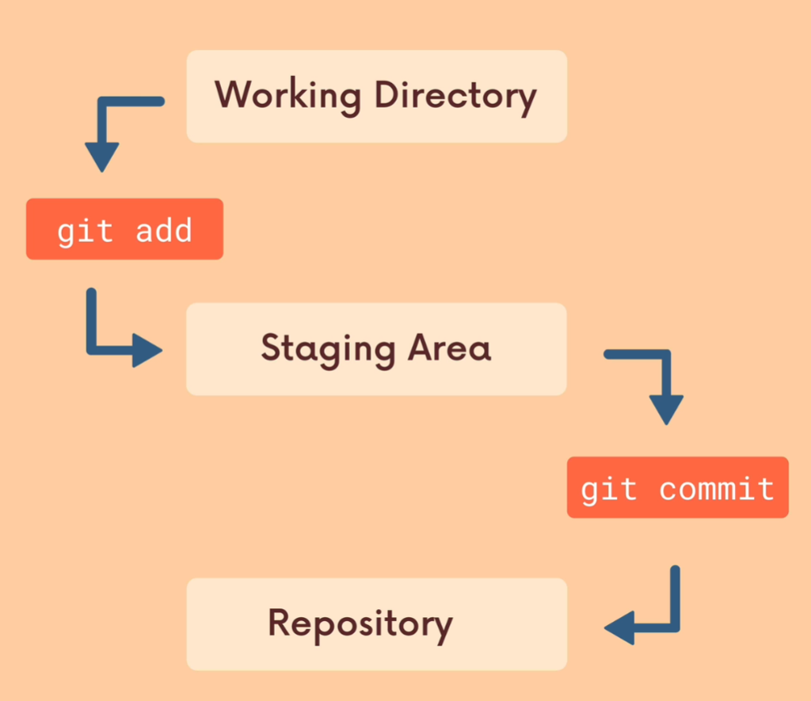

> Now that Git is hopefully installed/ itis time to configure
some basic information. YOU do not need to register for
an account or anythingı but YOU Will need to provide:<br>
>
> - Your `name` & `email` <br>
> 
> if you are using a GUI, it should prompt you for your
name and email the first time you open the app

To configure the name that Git Will
associate with your world run this command:

```properties
git config --global user.name "wiaoj"
```

Do the same thing for your email using the following
command. When we get to Github, you"ll want your
Git email address to match your Github account

```properties
git config --global user.email "wiaoj@git.com"
```

# Repository

A Git `Repo` is a workspace which tracks and
manages files within a folder.
Anytime we want to Use Git with a project, app,
etc we need to create a new git repository. We
can have as many repos on OUr machine as
needed, all with separate histories and contents

## First Git Command!

`git status` gives information on the current
status of a git repository and its contents
itis very useful, but at the moment we don't
actually have any repos to check the status of!

```properties
git status
```

[Git Status Document](https://git-scm.com/docs/git-status)

## Actual First Git Command!

Use `git init` to create a new git repository.
Before we can do anything git-related, we
must initialize a repo first!
This is something you do once per project.
Initialize the repo in the top-level folder
containing your project

```properties
git init
```

[Git Init Document](https://git-scm.com/docs/git-init)

# Committing 




## Adding

Use `git add` to add specific files to the staging
area. Separate files with spaces to add
multiple at once

```properties
git add file1 file2
```

> Use `git add .` to stage all changes at one

```properties
git add .
```

[Git Add Document](https://git-scm.com/docs/git-add)

## Git Commit

We use the `git commit` command to actually
commit changes from the staging area.
When makine a commit, we need to provide a
commit message that summarizes the changes
and work snapshotted in the commit

> Running `git commit` will commit all staged
changes. It also opens up a text editor and
prompts you for a commit message.
This can be overwhelming when you're starting
out, so instead you can use...

```properties
git commit
```

> The -m flag allows us to pass in an inline
commit message, rather than launching a text
editor.
We'll learn more about writing good commit
messages later on.

```properties
git commit -m "my message"
```

[Git Commit Document](https://git-scm.com/docs/git-commit)

# Git Log

```properties
git log
```

[Git Log Document](https://git-scm.com/docs/git-log)

- [Section Slide](./slides/Git+&+Github_+Basics.pdf) 
- [Section Slide Online](https://www.canva.com/design/DAEPH_Lq4Wk/wGpxJyUvCHfQT3jeXcs-Ww/view?utm_content=DAEPH_Lq4Wk&utm_campaign=designshare&utm_medium=link&utm_source=viewer)